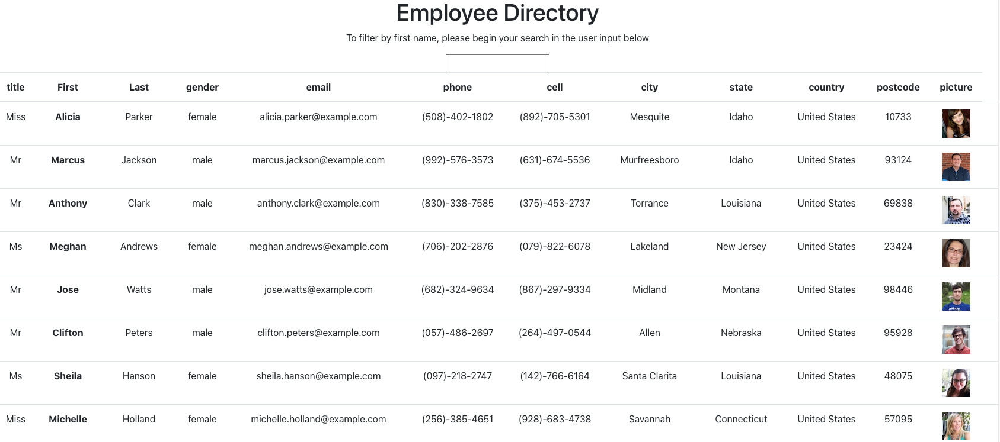

<h1 align="center">React Homework: Employee Directory</h1>

## Employee_Directory

- [Description](#description)
- [Installation](#installation)
- [Usage](#usage)
- [Contributing](#contributing)
- [Questions](#questions)

## Description

This is a Employee Directory application built with React. The directory will generate a list of random employee with non-sensitive data about each employee. The user is able to filter employees by name.

The application was deployed with GitHub pages.

Screenshot of the completed output:

## Installation

`npm i`

## Usage

Run the following command at the root of the directory and you will be able to view the local website at http://localhost:3000/Employee_Directory

`npm run start`

The project was deployed on Github Pages and can viewed at this website: https://kvadou.github.io/Employee_Directory/

## Contributing

:octocat: [Doug Kvamme](https://github.com/kvadou)

## Questions

Contact me with any questions: [email](mailto:dougkvamme@gmail.com) , [GitHub](https://github.com/kvadou) 
